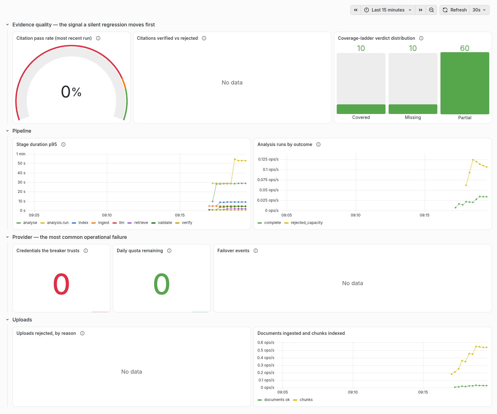

# Measurements

Every number in this file comes from a run recorded here, with the hardware,
model versions and date beside it. Nothing is estimated. Where something has
not been measured yet, it says `not measured` rather than carrying a
plausible-looking placeholder.

## Environment

| | |
|---|---|
| Machine | Apple MacBook Air, M2, 8 GB RAM, macOS 14.6 (Darwin 23.6.0) |
| Python | 3.13.9 |
| Embedding model | `BAAI/bge-small-en-v1.5` (384-dim) |
| NLI model (measured, not adopted) | `cross-encoder/nli-deberta-v3-base` |
| Vector store | ChromaDB 1.5.9, local persistent |
| Database | PostgreSQL 16 |

---

## Citation verification: embedding vs NLI

**Date:** 2026-08-30 · **Gemini calls:** 0 (reads stored analyses, Chroma and
local models only) · **Harness:** pulls every evidence item from the 11 stored
analyses, resolves the chunk each one cites, and scores the pair three ways.

### Dataset

| | |
|---|---|
| Stored analyses | 11 (EU ×4, Japan ×2, India ×2, Kenya ×2, Egypt ×1) |
| Evidence items | 471 |
| Resolved against the live index | 403 |
| Unresolvable (orphaned chunk ids) | 68 |

The 68 orphans predate `_deterministic_chunk_id()`: they were minted as
`uuid4` and re-ingestion gave the same text a new id. They are the residue of
a fixed bug, not a live one.

### What is actually being verified

`verify_gap_analysis_citations` passes `claim_text=text[:200]`, where `text`
is the excerpt the model quoted. So the check is *"is this quoted excerpt
consistent with the chunk it was drawn from"* — it catches fabricated quotes
and mis-attributed chunk ids. It is not an entailment check between an
analytical claim and its evidence, and the README no longer says it is.

**344 of 403 (85.4%)** quoted excerpts appear verbatim in the chunk they cite,
after collapsing whitespace (PDF extraction breaks words: `T ransparency`,
`Ar ticle`). For those, fabrication is impossible by construction.

### Results

| | Embedding (`bge-small`, cosine ≥ 0.65) | NLI (`nli-deberta-v3-base`) |
|---|---|---|
| Accepts | **363 / 403 (90.1%)** | 124 / 403 (30.8%) |
| Accepts, of the 344 verbatim-contained | **305 / 344 (88.7%)** | 100 / 344 (29.1%) |
| Latency per pair | 28.2 ms (2 embeds) | 86.7 ms |
| Cosine mean / median | 0.766 / 0.758 | — |
| Cosine min / max | 0.494 / 0.969 | — |

Agreement between the two paths: **164 / 403 (40.7%)**. Embedding accepts and
NLI rejects: **239**. NLI accepts and embedding rejects: **0**.

### Two bugs found along the way

Running the NLI path for the first time returned **362 of 403 (89.8%) labelled
"contradicts"** — on a set where 85% of excerpts are copied verbatim out of the
chunk they cite. An excerpt cannot contradict its own source, so the verifier,
not the data, was wrong. Two independent causes:

1. **Inverted label order.** `_verify_nli` read scores positionally as
   `[entailment, neutral, contradiction]`. The checkpoint reports
   `{0: contradiction, 1: entailment, 2: neutral}`, so contradiction was read
   as entailment and neutral as contradiction.
2. **Logits compared against probability thresholds.** `CrossEncoder.predict`
   returns raw logits for a multi-class head (observed roughly −6 to +6),
   compared directly against the 0.6 / 0.4 thresholds. A logit of `5.84` for
   *neutral* cleared a 0.4 "contradiction" bar purely by being a large number.

Both are silent: nothing raises, nothing logs, and the output still looks like
scores. Fixed by reading `id2label` from the checkpoint and applying softmax.
Contradictions fell from **362 to 14**. `tests/unit/test_nli_label_order.py`
pins both, including that a dominant *neutral* is never reported as a
contradiction.

Because the flag defaults to off, this never affected a shipped analysis. It
would have destroyed one the moment anyone switched it on.

### Decision

**The embedding path stays the default.** Even with both bugs fixed, NLI
rejects 71% of excerpts that are verbatim copies of their own source — false
negatives, not caught fabrications. A general-purpose MNLI checkpoint is
being asked to judge 512-character statutory fragments with OCR damage, which
is not the task it was trained for. It was later removed from the code
altogether.

Worth revisiting only with a checkpoint suited to legal text, and only against
this same dataset.

---

## Container image

**Date:** 2026-08-30 · Measured in CI on `ubuntu-latest`, `linux/amd64`.

| | Size |
|---|---|
| Before | **5,683 MB** |
| After removing the CUDA stack | **1,869 MB** (−67%) |

torch's default PyPI wheel bundles the NVIDIA CUDA runtime — 43 `nvidia-*`
packages, one of them a single 542 MB wheel. Meridian runs `bge-small` on CPU
and has no GPU code path, so Linux now resolves torch from PyTorch's CPU
index. macOS stays on PyPI, whose darwin wheels are already CPU-only.

Remaining size is dominated by torch itself (~500 MB CPU), plus
`sentence-transformers`, `chromadb` and the ~130 MB baked-in embedding model.
The model is deliberate: startup otherwise makes a network call to
huggingface.co before it can serve, and a DNS failure during one has already
taken this API down.

---

## Vulnerability scan

**Date:** 2026-08-30 · `trivy` in the release pipeline, scanning the built
`prod` image before it is pushed.

### Before and after

| Severity | First scan | After remediation |
|---|---|---|
| CRITICAL | 3 | 3 |
| HIGH | 16 | **13** |
| MEDIUM | 60 | **51** |
| LOW | 75 | **57** |
| UNKNOWN | 7 | 7 |
| **Total** | **161** | **131** |

Fixable HIGH/CRITICAL: **3 → 0**. The wider drop is a side effect of removing
the CUDA stack and the base image's `pip`: fewer packages in the image is
fewer things to have a CVE. What remains at HIGH/CRITICAL has no patch
available upstream.

### Baseline — first scan

| Severity | Count |
|---|---|
| CRITICAL | 3 |
| HIGH | 16 |
| MEDIUM | 60 |
| LOW | 75 |
| UNKNOWN | 7 |
| **Total** | **161** |

The gate covers HIGH/CRITICAL **with a fix available** (`--ignore-unfixed`).
Three qualified, and the gate blocked the push while the image was still
private — which is the reason the scan runs before the push rather than after.

### What was fixed, and how

All three were fixed at source. **`.trivyignore` is empty** — nothing has been
allowlisted.

| Package | Advisory | Resolution |
|---|---|---|
| `openssl` / `libssl3t64` 3.5.6-1~deb13u2 | CVE-2026-14456 (HIGH) | The base image tag lags the Debian security archive. The base stage now runs `apt-get upgrade`, pulling 3.5.7-1~deb13u2. |
| `setuptools` 70.3.0 | CVE-2025-47273 (HIGH) | Not a Meridian dependency — vendored inside the base image's `pip`. Our locked setuptools is 84.0.0. |
| `msgpack` 1.1.2 | GHSA-6v7p-g79w-8964 (HIGH) | Also vendored inside `pip`; nothing in the project depends on msgpack. |

The last two were resolved together by removing `pip` from the production
stage. The application runs entirely from `/opt/venv` and never invokes the
system installer, so a package manager in a production image was surface with
no purpose.

The remaining CRITICAL/HIGH findings have no fix available upstream
(`chromadb` CVE-2026-45829, `perl-base` CVE-2026-13221, `ncurses`
CVE-2025-69720 and others). They are reported and tracked in the Security tab
via SARIF, and are not suppressed — `--ignore-unfixed` means the gate does not
fail on something this repository cannot act on, which is a different thing
from pretending it is not there.

---

## Test suite

**Date:** 2026-09-30 · Measured on the environment above.

| | |
|---|---|
| Result | 1,395 passed, 26 skipped |
| Wall clock | ~25 s (~65 s with coverage, including the golden set) |
| Coverage (`src`) | **82%** (8,931 statements, 1,579 missed) |

The 26 skips are deliberate and all need external state: 9 Azurite storage
integration tests (they run in CI, where Azurite is a service container),
5 evaluation tests behind `RUN_EVALUATION_TESTS=1` and 2 role tests that need
an indexed framework corpus, 3 integration tests behind
`RUN_INTEGRATION_TESTS=1`, 6 live-gate tests behind `MERIDIAN_LIVE_GATE=1`,
and 1 needing a PDF with a real text layer.

### Bugs the coverage work found

Writing the first test that exercised a module found six real defects, none
of which any existing test would have caught:

| Defect | Effect |
|---|---|
| `_gemini_throttles()` sized its list from a module global while the caller indexed it from a different provider | `IndexError` mid-analysis instead of degrading |
| `rotate_key()` reported exhaustion whenever round-robin landed on the last credential | one 429 declared the whole pool spent while N-1 were untried |
| `completed_dimensions` was read by the except block but assigned after ingestion | any ingestion failure raised `UnboundLocalError`, masking the real error and wedging the workspace in `PROCESSING` |
| `_estimate_chunk_page` truncated with `int()` | a section's last page was unreachable; every page estimate biased low, turning correct citations into page mismatches |
| NLI label order read positionally | 89.8% of citations labelled "contradicts" (see above) |
| `CrossEncoder.predict` logits compared to probability thresholds | same |

Coverage moved 60% -> 78% by testing the modules that had none rather than
by padding the ones that already did. The largest movers:

| Module | Before | After |
|---|---|---|
| `tasks.py` (the orchestrator) | 0% | 60% |
| `main.py` (every API route) | 36% | 73% |
| `provider_router.py` | 26% | 78% |
| `chat.py` | 10% | 64% |
| `governance_advisor.py` | 17% | 71% |
| `gap_analyzer.py` | 72% | 83% |

Still low and stated plainly: `framework_sync.py` 31% (it downloads PDFs),
`vectorstore.py` 50% (the rest needs a real Chroma collection), and
`document_overview.py` 39%.

The CI gate is **76%** — just below measured, so it catches regression
without being aspirational.

---

## Release pipeline

**Date:** 2026-08-30 · Measured on GitHub-hosted runners.

| | QEMU emulation | Native runners |
|---|---|---|
| scan + SBOM | 4m18s | **2m23s** |
| build linux/amd64 | — | **1m07s** |
| build linux/arm64 | ~20 min (emulated) | **1m01s** |
| publish manifest | — | **23s** |
| **Total** | **~22 min** | **~4 min** |

arm64 was built through QEMU emulation, which for a torch-sized image was
slow enough that queued release runs piled up and got cancelled — and a
cancelled run renders as a red badge. Native `ubuntu-24.04-arm` runners are
free for public repositories; the two architectures now build in parallel and
a manifest list is assembled from their digests.

---

## Published image

**Date:** 2026-08-30 · Verified by fetching an anonymous pull token from
ghcr.io with no credentials, then requesting the manifest index.

```
docker pull ghcr.io/eklavya072/meridian:latest
```

| | |
|---|---|
| Anonymous manifest fetch | HTTP 200 |
| Platforms | `linux/amd64`, `linux/arm64` |
| Digest | `sha256:400a4873b838d1b89194d982c45e5fb3cda4593fbfd7e08a02e76b03b21166f0` |

---

## Live pipeline verification after the DevOps work

**Date:** 2026-08-30 · **Gemini calls: 1.** The point was to confirm the real
analysis path still works after the storage interface, the upload hardening
and the config-path changes — not to regenerate any stored analysis.

Without Gemini, on a real policy PDF (India AI Governance Guidelines, 0.5 MB,
8 pages), through the exact path the upload and pipeline now take:

| Step | Result |
|---|---|
| `validate_pdf_file` | valid, 0.28 s |
| `storage.put` → `exists` → `get` | reference resolves, bytes identical |
| `storage.local_path` → `ingest_document` | 14 chunks in 0.4 s |
| Chunk ids | deterministic (`ad8784f0-…`), stable across runs |

With Gemini, one small structured call through `generate_with_retry`:

| | |
|---|---|
| Model | `gemini-3.6-flash` |
| Latency | 2.84 s |
| Result | `T4 Enforceable` for *"a provider who fails to report shall be liable to a penalty"* — the correct tier |
| RPD counter | 0 → 1, persisted to `data/gemini_rpd.json` |

That last row matters beyond the provider check: `quota_status()` is what
`/readyz` reports, so the probe and the pipeline are demonstrably reading the
same counter.

---

## Provider resilience (INCIDENT-001 drill)

**Date:** 2026-08-30 · **Gemini calls: 0.** Mocked provider returning
`429 RESOURCE_EXHAUSTED` with `Retry-After: 37` across three credentials.

| | |
|---|---|
| Credentials dropped after | **3 consecutive failures each** |
| Capacity exhaustion detected after | **9 failed calls** (3 credentials × 3) |
| In-process detection latency | 0.002 s — flattering; the 9-call figure is the honest one |
| `/readyz` response once exhausted | **503**, `credentials_healthy: 0`, `has_headroom: true` |
| Recovery | automatic, one probe per credential after cooldown |

One measurement the design did not intend: `seconds_until_any_available`
reported 60 s while the provider's `Retry-After` asked for 37 s. The cooldown
takes the longer of the two, which is safe but delays recovery by 23 s. See
[INCIDENT-001.md](INCIDENT-001.md).

---

## Load test — the real path, in replay mode

**Date:** 2026-08-30 · **Gemini calls: 0.** k6 against a locally-running API
with `MERIDIAN_REPLAY=1`, driving the actual path: create workspace → upload
a 546 KB / 8-page policy PDF → run analysis → poll until a brief exists.

Replay mode fakes **only the provider**. PDF validation, chunking,
embedding, vector indexing, retrieval, the deterministic ladder and citation
verification all run for real, with a fixed 50 ms per simulated LLM call.
That is the point: it isolates Meridian's own cost from the provider's
latency, which is the more useful engineering number — and pointing k6 at a
paid, rate-limited API would measure that API's queue while burning quota.

### Environment

| | |
|---|---|
| Machine | Apple MacBook Air, M2, 8 GB RAM, macOS 14.6 |
| Load profile | ramping VUs: 1 → 2 (30 s) → 5 (60 s) → 0 (30 s) |
| `MAX_CONCURRENT_ANALYSES` | 2 |
| Postgres | 16, local, isolated database |
| Chroma | empty at start (local, persistent) |

### End-to-end (upload accepted → analysis available)

| | |
|---|---|
| p50 | **4.93 s** |
| p90 | **6.61 s** |
| p95 | **6.85 s** |
| max | 7.64 s |
| mean | 4.60 s |

### By stage

| Stage | mean | p95 |
|---|---|---|
| Upload (validate, store, queue) | 531 ms | 1.19 s |
| Run trigger (admission + dispatch) | 43 ms | 196 ms |
| Analysis (ingest → index → score → verify) | 4.08 s | 6.28 s |

Analysis dominates, as expected — it is the only stage doing real work per
document.

### Throughput, errors and backpressure

| | |
|---|---|
| Iterations completed | 81 over 2 min |
| Throughput | 0.67 analyses/s, 3.4 HTTP req/s |
| Checks passed | **207 / 207 (100%)** |
| Server errors (5xx, timeouts) | **0** |
| Capacity rejections (429) | **36** |
| Peak worker RSS | **51 MB** |

The 36 rejections are the headline result, not a failure. With
`MAX_CONCURRENT_ANALYSES=2`, five concurrent users produced 45 admitted runs
and 36 refused ones — and every refusal was an immediate 429 naming the
limit, not a queued request holding a connection open until it timed out.
`/metrics` recorded exactly the same split
(`meridian_analysis_runs_total{outcome="complete"} 45`,
`{outcome="rejected_capacity"} 36`), which is the domain metrics agreeing
with an external observer under real traffic.

k6's overall `http_req_failed` reads 8.78%, and that number is misleading on
its own: filtered to responses that were *supposed* to succeed it is
**0.00%**. A 429 under saturation is correct behaviour, so the threshold is
scoped to exclude it.

### What this does not measure

- Live provider latency. See the traced live run below.
- Citation quality. Replay fixtures produce no evidence items, so
  `meridian_citation_pass_rate` stays at its initial value here; the
  citation numbers come from the verification measurement above instead.
- A warm vector index. Chroma started empty, so retrieval had less to scan
  than a production instance with a 15,468-chunk corpus, and peak RSS is
  correspondingly low.

## End-to-end, traced — live and replay

**Date:** 2026-09-30 · **Revision:** `83d2572` · **Gemini calls: 11** (live
run only; replay makes none). One document, the same one as above (India AI
Governance Guidelines, 546 KB, 8 pages), driven over HTTP through the real
path: create workspace → upload → run → poll until complete → generate the
brief → export the PDF. Timings come from the driver; the stage breakdown
comes from the run's OpenTelemetry spans (`OTEL_TRACES_EXPORTER=console`).

| | |
|---|---|
| Machine | Apple MacBook Air, M2, 8 GB RAM, macOS 14.6.1 |
| API | uvicorn, one worker, isolated Postgres database |
| Corpus | a copy of the production index: 43 frameworks, warm |
| LLM | `gemini-3.5-flash-lite`, one credential, `GEMINI_RPM_LIMIT=12` |
| Embedding | `BAAI/bge-small-en-v1.5` |

### End-to-end

| | Live (n=1) | Replay, warm (n=4) | Replay, cold (n=1) |
|---|---|---|---|
| Upload | 0.46 s | 0.35–0.62 s | 0.47 s |
| Analysis (run → complete) | **75.4 s** | 11.7–12.7 s | 35.0 s |
| Brief | 2.70 s | 0.07 s | 0.08 s |
| PDF export | 0.30 s | 0.02–0.03 s | 0.12 s |
| **Upload → exported PDF** | **78.9 s** | **12.4–13.2 s** | 35.7 s |

The live figure is one run and is reported as one run, not a percentile.
The live run completed all eight dimensions with 10 analysis calls and one
brief call, and every one of its 39 evidence items passed verification; the
brief records `mode: live` and the model in its provenance. The cold replay
run is the first request after start-up, which loads the embedding model and
warms Chroma.

### By stage (spans)

| Stage | Live | Replay (warm) |
|---|---|---|
| `validate` | 0.53 s | 0.33 s |
| `ingest` (parse, chunk) | 0.97 s | 0.67 s |
| `index` (embed, store) | 1.01 s | 0.38 s |
| `analyse` | 72.4 s | 10.1 s |
| — `retrieve` (21–23 calls) | 9.00 s total | 7.42 s total |
| — `llm` (10 calls) | 88.2 s summed, 8.8 s mean, 18.3 s max | 0.56 s (stubbed) |
| `verify` (8 calls) | 0.03 s | < 0.01 s |
| `synthesise` (brief) | 2.65 s | — |
| `export` (PDF) | 0.28 s | — |

The model calls run three at a time, which is why their summed time exceeds
the `analyse` stage that contains them. Everything under one run is a single
trace: 46 spans in the live run, one of them without a parent (the root).

Two conclusions. Live, the provider is almost all of it: about 61 of the
72 seconds of `analyse` (the stage, less 9.0 s of retrieval and the ~2 s of
scoring the replay run shows). Without it, Meridian's own cost is about ten
seconds, and retrieval over the full corpus is most of that — which is also
why warm replay here takes 12–13 s against the 4.9 s p50 of the load test
above, whose Chroma started empty.

## Rollout and rollback — the drills

**Date:** 2026-09-30 · **Gemini calls: 0.** `.github/workflows/drills.yml`,
`rollout` job, on a GitHub-hosted runner (4 vCPU, 15 GB). The production
compose file with the Chroma server, Caddy in front, and two published
releases: start on `sha-b5762d5…`, roll out `sha-83d2572…` with
`deploy/rollout.sh`, then roll back the same way. A prober requests
`/healthz` through Caddy continuously (100 ms sleep plus the request) and
every response is recorded.

| Run | Rollout | Rollback | Probes | Failed |
|---|---|---|---|---|
| [36694167380](https://github.com/eklavya072/Meridian-AI-Governance-Intelligence/actions/runs/36694167380) | 8.9 s (ready 7.3 s) | 8.8 s (ready 7.3 s) | 302 | **0** |
| [36694895440](https://github.com/eklavya072/Meridian-AI-Governance-Intelligence/actions/runs/36694895440) | 9.2 s (ready 7.3 s) | 9.1 s (ready 7.2 s) | 307 | **0** |

"Ready" is the new container's `/readyz`; the rest is draining and removing
the old one. Both images were already pulled (0.2–0.4 s), so a cold pull of
the 1.9 GB image adds its download time on top. After each switch the drill
reads the running container's image, and it matched the release requested.

**What the drill found.** Caddy first used a dynamic upstream (`dynamic a`,
refreshed each second). In one run 3 of 148 probes stalled for the full 2 s
timeout, and Caddy logged `failed getting dynamic upstreams; falling back to
static upstreams: lookup api: operation was canceled`. A plain `api:8000`
upstream is resolved on every connection instead; the two runs above are
after that change.

---

## Dashboard and traces under replay traffic — the drills

**Date:** 2026-09-30 · **Gemini calls: 0.** `drills.yml`, `dashboard` job
([run 36694895440](https://github.com/eklavya072/Meridian-AI-Governance-Intelligence/actions/runs/36694895440)),
same runner. The `observability` compose profile on the published image
`sha-83d2572…` in replay mode, Chroma empty at start, k6
(`loadtest/upload_to_brief.js`) driving the real upload-to-brief path; then
the provisioned dashboard rendered by Grafana's image renderer and the traces
read back from Jaeger.



| | |
|---|---|
| k6 iterations | 41 (checks 92/92) |
| Analyses completed / refused with 429 | 10 / 31, matching `meridian_analysis_runs_total` |
| Upload → analysis available | p50 22.4 s, p95 35.2 s |
| Traces in Jaeger | 51, of which 10 `analysis.run` |
| Largest run trace | 46 spans: `analyse` 13.1 s, `retrieve` ×23 8.8 s, `index` 5.1 s, `ingest` 1.1 s, `llm` ×10 0.5 s |

Read the provider and citation panels for what they are in replay mode: no
credential is configured, so the breaker and quota panels read 0, and the
replay provider cites nothing, so the citation panels are empty. Latency here
is the runner's, with two analyses admitted at a time, and is not comparable
with the M2 figures above.

---

## Not yet measured

- A live latency distribution. The live figure above is a single run.
- Provider failover behaviour under a real 429 storm
